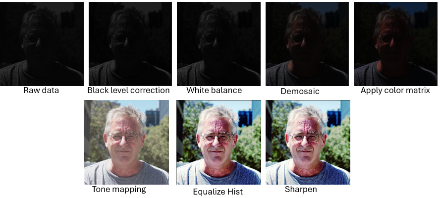

## Project Overview: camera image processing pipeline




This is a simple project focused on developing algorithms for a camera imaging pipeline. 
The project references [this repository](https://github.com/mushfiqulalam/isp) and utilizes raw image data and the pipeline framework. 
A C++ implementation was developed using OpenCV, and CUDA implementations for certain time-consuming functions were developed. 
For studying purpose, this project avoids directly using OpenCV's built-in features and functions, mainly using `cv::Mat` as a container.

## Implemented Pipeline

- black level correction
- bad pixel correction 
- channel gain while balance
- demosaic
- process local color ratio
- apply color matrix
- gamma
- purple fringe removel
- tone mapping
- equalize histogram
- sharpening


## Features


 - **Black Level Correction:** Adjusts pixel values to accurately represent the darkest areas in an image, eliminating any offset caused by the camera sensor. For each (R, Gr, Gb, B) data point, the offset is corrected using the formula:

  ```math 
  \text{corrected\_val} = \frac{{\text{pixel\_val} - \text{black\_level}}}{{\text{white\_level} - \text{black\_level}}} \times (2^{\text{bit\_depth}} - 1)
```
  This normalization ensures that the pixel values are accurately scaled between the black and white levels of the sensor.

- **Bad Pixel Correction:** Utilizes a median filter to correct pixel values. Pixels that significantly deviate from the median value of their neighboring pixels are identified as bad pixels and are replaced with the median value of their neighborhood. This helps in reducing noise and artifacts caused by defective pixels in the sensor.

- **Channel Gain White Balance:**
  Applies gain to each channel to balance the color. The transformation is defined as:
```math
  \begin{bmatrix}
  R_{\text{out}} \\
  G_{\text{out}} \\
  B_{\text{out}}
  \end{bmatrix}
  =
  \begin{bmatrix}
  r_g & 0 & 0 \\
  0 & g_g & 0 \\
  0 & 0 & b_g
  \end{bmatrix}
  \begin{bmatrix}
  R_{\text{in}} \\
  G_{\text{in}} \\
  B_{\text{in}}
  \end{bmatrix}

```
   One way to obatin the gains for each channel \([r_g, g_g, b_g]\) can be computed by the maximum brightness point method, which finds the values corresponding to white color. The gains are determined as:
 ```math
  [r_g, g_g, b_g] = \left[\frac{R_{\text{white}}}{R_{\text{max}}}, \frac{G_{\text{white}}}{G_{\text{max}}}, \frac{B_{\text{white}}}{B_{\text{max}}}\right]
```
- **Demosaic:**: Converts the Bayer pattern image into a RGB image. Two methods were implemented (1) Bilinear interpolation, and directionally weighted gradient based interpolation.

- **Local color ratio**: To enhance the quality of the demosaicing process by using local color ratio adjustments. Details steps are desribed in the end the note (Appendix).
  
- **Apply color matrix**: To performing color correction on an image by applying a color correction matrix.
```math
R_{\text{corrected}}(i, j) =  R(i, j) \cdot \text{cam2rgb}_{00} + G(i, j) \cdot \text{cam2rgb}_{01} + B(i, j) \cdot \text{cam2rgb}_{02})
```
```math
G_{\text{corrected}}(i, j) =  R(i, j) \cdot \text{cam2rgb}_{10} + G(i, j) \cdot \text{cam2rgb}_{11} + B(i, j) \cdot \text{cam2rgb}_{12})
```
```math
B_{\text{corrected}}(i, j) =  R(i, j) \cdot \text{cam2rgb}_{20} + G(i, j) \cdot \text{cam2rgb}_{21} + B(i, j) \cdot \text{cam2rgb}_{22})
```

- **Gamma:** To enhance brightness by applying some non-linear logarithm and exp operations.
  
- **Tone mapping** See N. Moroney, “Local color correction using non-linear masking”.
  
- **Sharpenging** (2 x original image - blurred one)
### Prerequisites

- C++ compiler (e.g., GCC, Clang)
- CMake
- OpenCV library
- CUDA

### Installation

```bash
git clone https://github.com/fuli2bb/isp-proj.git
cd isp-proj
rm -rf build
mkdir build
./build.sh
```
### Run command

```bash
./build/isp config.ini
```

### CUDA functions

At this moment, CUDA implementations of bad_pixel_correction and histogram equalization functions were provided. Below is a comparison of running times between CPU and GPU code. （test on cuda 10 and a geforce rtx 2080 ti gpu).
- **Bad pixel correction** function 
  | Image size | 768x512  | 2048x2048 | 6032x4032 |
  |------------|----------|-----------|-----------|
  | CPU        | 0.547 s  | 5.24 s    | 30.65 s   |
  | CUDA       | 0.0952 s | 0.1686 s  | 0.588 s   |

- **Equalize hist** function 
  | Image size | 768x512  | 2048x2048 | 6032x4032 |
  |------------|----------|-----------|-----------|
  | CPU        | 0.029 s  | 0.267 s   | 1.64 s    |
  | CUDA       | 0.004 s  | 0.027 s   | 0.32 s    |

For the equalization of the histogram function, the CUDA implementation can be further accelerated by considering [this approach](https://developer.nvidia.com/gpugems/gpugems3/part-vi-gpu-computing/chapter-39-parallel-prefix-sum-scan-cuda).


### Appendix A. Local color ratio

1. **Initialization**:
    - Add `beta` to the data to avoid division by zero.
      ```math
      \text{data\_beta}(i, j) = \text{data}(i, j) + \beta
      ```

2. **Define Convolution Kernels**:
    ```math
    \text{zeta1} = \begin{pmatrix}
    0 & 0.25 & 0 \\
    0.25 & 0 & 0.25 \\
    0 & 0.25 & 0 
    \end{pmatrix}, \quad \text{zeta2} = \begin{pmatrix}
    0.25 & 0 & 0.25 \\
    0 & 0 & 0 \\
    0.25 & 0 & 0.25 
    \end{pmatrix}
    ```


3. **Compute Local Color Ratios**:
    - Green over Blue ratio:
      ```math
      G_{B}(i, j) = \frac{G(i, j)}{B(i, j)}
      ```
    - Green over Red ratio:
      ```math
      G_{R}(i, j) = \frac{G(i, j)}{R(i, j)}
      ```
    - Blue over Green ratio smoothed by `zeta2`:
      ```math
      B_{G2}(i, j) = \text{convolve}\left(\frac{B(i, j)}{G(i, j)}, \text{zeta2}\right)
      ```
    - Red over Green ratio smoothed by `zeta2`:
      ```math
      R_{G2}(i, j) = \text{convolve}\left(\frac{R(i, j)}{G(i, j)}, \text{zeta2}\right)
      ```
    - Blue over Green ratio smoothed by `zeta1`:
      ```math
      B_{G1}(i, j) = \text{convolve}\left(\frac{B(i, j)}{G(i, j)}, \text{zeta1}\right)
      ```
    - Red over Green ratio smoothed by `zeta1`:
      ```math
      R_{G1}(i, j) = \text{convolve}\left(\frac{R(i, j)}{G(i, j)}, \text{zeta1}\right)
      ```

4. **Apply Color Ratio Adjustments**:
    - For Bayer pattern "rggb":
    
        - **Green at Blue locations**:
          ```math
          G(i, j) = -\beta + B(i, j) \cdot G_{B}(i, j)
          ```
        - **Green at Red locations**:
          ```math
          G(i, j) = -\beta + R(i, j) \cdot G_{R}(i, j)
          ```
        - **Blue at Red locations**:
          ```math
          B(i, j) = -\beta + G(i, j) \cdot B_{G2}(i, j)
          ```
        - **Red at Blue locations**:
          ```math
          R(i, j) = -\beta + G(i, j) \cdot R_{G2}(i, j)
          ```
        - **Blue at Green locations**:
          ```math
          B(i, j) = -\beta + G(i, j) \cdot B_{G1}(i, j)
          ```
        - **Red at Green locations**:
          ```math
          R(i, j) = -\beta + G(i, j) \cdot R_{G1}(i, j)
          ```


